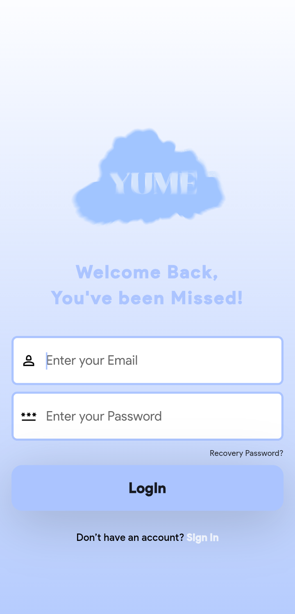
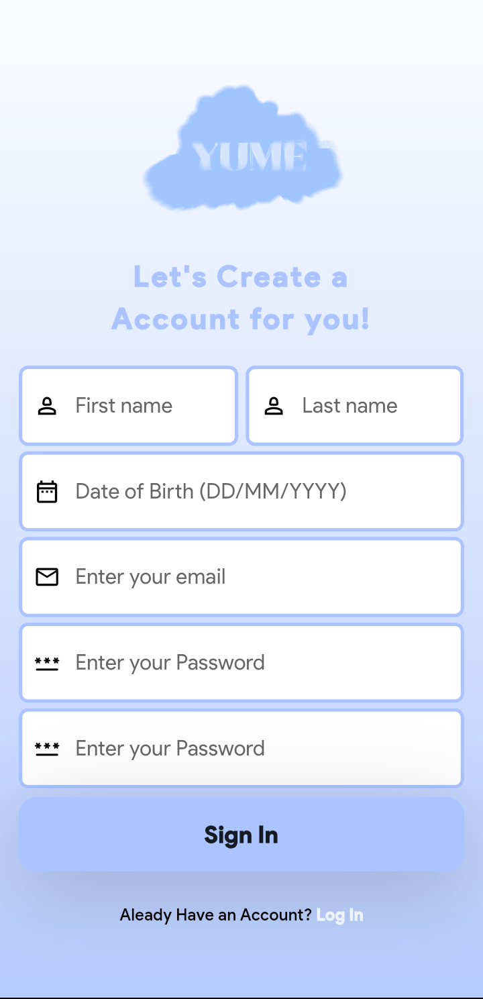
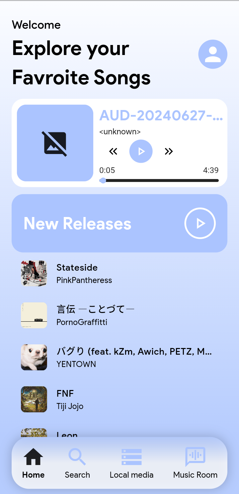
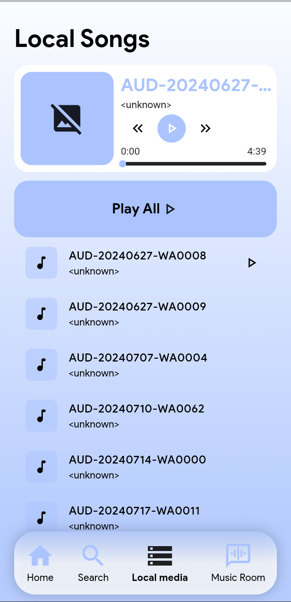
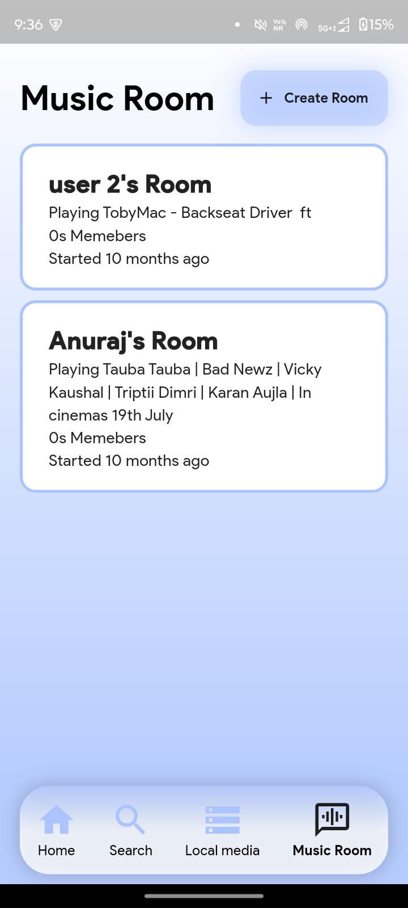
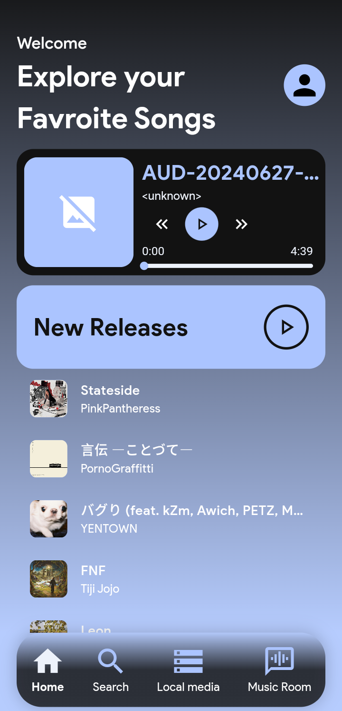

# Yume - Tunes from the Dreams

Yume is a Flutter-based audio streaming platform designed to revolutionize the way users discover, play, and share music. With intelligent search capabilities, personalized playlists, music rooms for shared listening, and seamless integration with Firebase, Yume provides a comprehensive and immersive music experience.

---

## Features

- 🎵 **Personalized Music Recommendations**: Discover tracks tailored to your preferences.
- 🎤 **Music Rooms**: Join or create rooms to listen to the same song with others and engage in live chat.
- 📀 **Offline & Online Playback**: Play local tracks offline or stream directly from Spotify and YouTube.
- 📱 **Cross-Platform Compatibility**: Available on Android, iOS, and other platforms.
- ✨ **Modern UI/UX**: Intuitive interface with smooth navigation.

---

## Getting Started

Follow these steps to get the project running locally on your machine.

### Prerequisites

- 🛠️ Flutter SDK installed ([Flutter Installation Guide](https://flutter.dev/docs/get-started/install))
- 🔥 Firebase account ([Firebase Console](https://console.firebase.google.com/))
- 🖥️ Android Studio or Visual Studio Code for development
- 📚 Basic knowledge of Flutter and Dart

### Installation

1. **Clone the Repository:**

   ```bash
   git clone https://github.com/yourusername/yume.git
   cd yume
   ```

2. **Install Dependencies:**

   ```bash
   flutter pub get
   ```

3. **Generate Firebase Configuration:**
   Follow the steps below to set up Firebase.

### Setting up `firebase_options.dart`

To generate the required `firebase_options.dart` file:

1. Install Firebase CLI ([Guide](https://firebase.google.com/docs/cli)).
2. Run the following command in your terminal:
   ```bash
   flutterfire configure
   ```
3. Select the Firebase project and platforms to configure.
4. The `firebase_options.dart` file will be automatically generated in the `lib` directory.

### Setting up `google-services.json`

To obtain and configure `google-services.json`:

1. **Go to Firebase Console:**

   - Visit [Firebase Console](https://console.firebase.google.com/) and log in with your Google account.

2. **Create a Project:**

   - Click on "Add project" or select an existing project.
   - Follow the steps to configure your project.

3. **Add Your App:**

   - In the project dashboard, click "Add App" and choose "Android."
   - Provide your app's package name (must match the package name in `AndroidManifest.xml`).

4. **Download the Configuration File:**

   - Once the app is registered, you will be prompted to download the `google-services.json` file.
   - Download it and save it.

5. **Place the File:**

   - Copy the `google-services.json` file into the `android/app` directory of this project.

6. **Sync Your Project:**
   - Run `flutter pub get` to sync your project with Firebase.

### Configuring Spotify Credentials

To enable Spotify integration, developers must provide their own Spotify Client ID and Client Secret:

1. Visit the [Spotify Developer Dashboard](https://developer.spotify.com/dashboard/).
2. Create an app to obtain your **Client ID** and **Client Secret.**


### Running the Project

Run the application using the command:

```bash
flutter run
```

---

## Screenshots

### 1. Welcome Page


### 1. Login


### 2. Signin


### 3. Home Screen



### 4. Local songs



### 5. Voice Room



### 6. Dark Themed
<div>
   
   
   
</div>


---

## Contribution

Feel free to fork the repository and submit pull requests. Contributions are always welcome!

---
